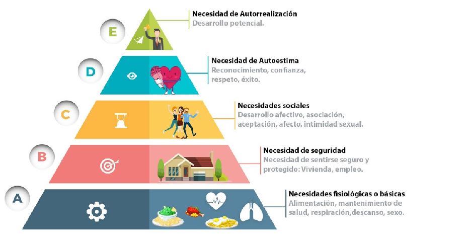
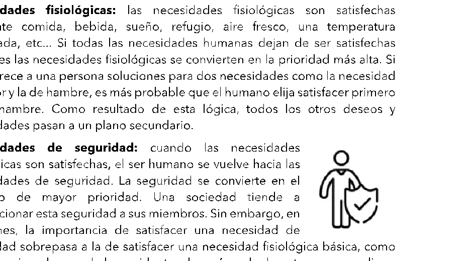
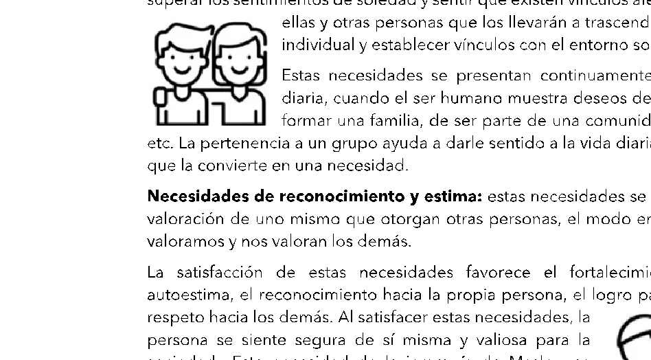
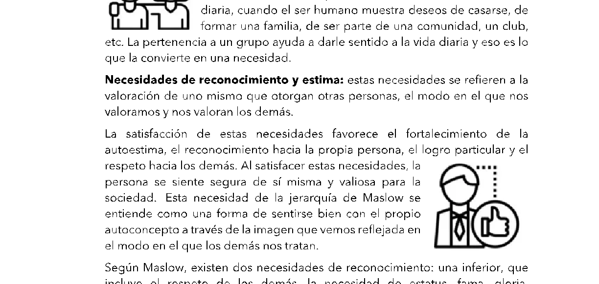
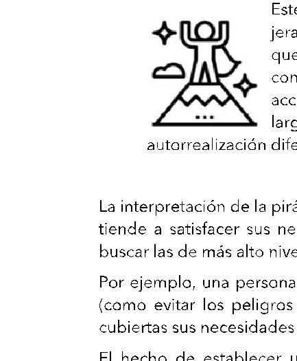

# Experto en

Project Management

## Unidad 7: Gestión del equipo del proyecto y liderazgo adaptativo

La ejecución exitosa de un proyecto no depende únicamente de un buen plan o de recursos adecuados. En el centro de todo proyecto se encuentran las personas: las que toman decisiones, resuelven problemas, generan valor, enfrentan incertidumbre y construyen resultados en interacción con otras. Por eso, gestionar proyectos implica, necesariamente, gestionar equipos. Y hacerlo con inteligencia, sensibilidad y estrategia.

Esta unidad está dedicada a comprender a fondo qué significa liderar un equipo de proyecto. No nos limitaremos a describir funciones o estructuras, sino que nos adentraremos en los elementos que determinan el desempeño colectivo: la motivación, la autonomía, la confianza, la cultura compartida, la distribución de roles y la capacidad de aprendizaje conjunto.

Abordaremos el liderazgo no como un rasgo individual, sino como un proceso de influencia que se ejerce en distintos niveles y estilos, dependiendo del contexto y del equipo. Analizaremos cómo distintos enfoques —desde el liderazgo situacional hasta las herramientas de Management 3.0— permiten al Director de Proyecto adaptarse a realidades diversas, fortaleciendo el compromiso y la efectividad de su equipo.

También exploraremos las claves del trabajo colaborativo en entornos complejos, con especial atención a la construcción de equipos de alto rendimiento, el respeto por la diversidad y la integración de nuevas prácticas para desarrollar equipos más conscientes, autónomos y orientados a resultados.

Esta unidad no propone fórmulas universales. Propone herramientas para pensar, contrastar y elegir. Porque cada equipo es único, y liderarlo implica leer su momento, comprender su dinámica y tomar decisiones que equilibren los objetivos del proyecto con el bienestar de quienes lo hacen posible.

## Objetivos de la Unidad

- • Identificar las características fundamentales de los equipos de proyecto, reconociendo los factores que inciden en su cohesión, efectividad y rendimiento colectivo.
- • Analizar los distintos estilos de liderazgo y su impacto en la motivación del equipo, comprendiendo la diferencia entre poder, autoridad y liderazgo genuino.
- • Evaluar estrategias para fortalecer la autonomía, el accountability y el desempeño colectivo, integrando herramientas adaptadas a diferentes contextos de proyecto.
- • Aplicar enfoques y herramientas innovadoras como Personal Maps, Moving Motivators y Personal Canvas, promoviendo una cultura de equipo más empática, reflexiva y comprometida con el propósito del proyecto.

## Bloques temáticos

- 7.1 Características de los equipos de proyecto
- 7.2 Cultura del equipo y diversidad Team building Matriz RACI
- 7.3 Liderazgo situacional y adaptativo
- 7.4 Equipos de alto rendimiento
- 7.5 Estilos de liderazgo y motivación
- 7.6 Accountability y autonomía
- 7.7 Evaluación del desempeño del equipo
- 7.8 Herramientas de Management 3.0 Personal Maps Moving Motivators Personal Canvas
- 7.9 Reflexión integradora

#### Referencias:

IMPORTANTE EJEMPLO REFLEXIÓN CITA

## 7.1 Características de los equipos de proyecto

Un equipo de proyecto no es simplemente un grupo de personas asignadas a una tarea común. Tampoco es la suma de talentos individuales puestos a trabajar en paralelo. Es una entidad dinámica, interrelacionada, que cobra sentido cuando sus miembros dejan de operar como individuos aislados y comienzan a construir resultados colectivos, integrando saberes, competencias, expectativas y responsabilidades de forma coordinada.

En este punto radica una de las diferencias más importantes entre un grupo y un equipo: el equipo opera desde la interdependencia y con una identidad

compartida.

Desde esta perspectiva, un equipo de proyecto puede definirse como una unidad compuesta por personas que se organizan en torno a una tarea común, se relacionan entre sí a través de procesos de cooperación estructurada y reconocen que sus resultados dependen del trabajo complementario y coordinado de todos los miembros. No alcanza con reunir profesionales competentes y asignarles funciones: se necesita construir condiciones de funcionamiento que den soporte a ese trabajo colectivo.

Entre las principales características que definen a un equipo de proyecto en funcionamiento efectivo, podemos destacar:

En primer lugar, la existencia de una visión compartida y objetivos en común. Los miembros del equipo deben entender no sólo qué deben hacer, sino por qué lo hacen y cómo su aporte contribuye al propósito general del proyecto. Esta claridad de propósito no siempre está dada desde el inicio, por eso es recomendable facilitar dinámicas donde los equipos puedan definir o reformular su misión y sus metas en conjunto.

Además, todo equipo debe construir un fuerte sentido de interdependencia. Es necesario que los integrantes reconozcan que necesitan a los otros para lograr el resultado. Cuando cada miembro actúa como si pudiera alcanzar el objetivo de manera autónoma, se disuelve la lógica del equipo y se cae en compartimentos

estancos. La interdependencia también se traduce en complementariedad de roles y en interacción frecuente.

Otra característica clave es la existencia de roles y responsabilidades definidos y asumidos. Los equipos de proyecto funcionan mejor cuando cada persona tiene claridad respecto a qué se espera de ella, qué decisiones puede tomar, a quién debe consultar y qué resultados debe entregar. Esta definición no debe quedar implícita o sujeta a interpretación, sino acordarse explícitamente. Una herramienta valiosa en este sentido es la elaboración de un “código de cooperación” o una matriz RACI, que haga visible quién hace qué, con qué autoridad y ante quién responde.

El funcionamiento efectivo también requiere procesos internos consensuados. No se trata sólo de saber quién hace qué, sino de cómo se

coordina el trabajo. La distribución de tareas, los mecanismos de validación, los canales de comunicación y los espacios de toma de decisiones deben ser definidos por el propio equipo y estar orientados a una mejora continua de la calidad y de la colaboración.

Asimismo, un buen equipo no se construye sólo en torno a la tarea, sino también a partir de las personas que lo componen. Por eso, se valora que el trabajo en equipo promueva también el crecimiento individual, permitiendo que cada miembro encuentre oportunidades para desarrollarse, aprender y alcanzar sus propios objetivos profesionales dentro del marco del proyecto. Integrar estos objetivos personales con los del proyecto requiere una gestión sensible, que vea al equipo como un espacio de desarrollo humano además de técnico.

En relación con lo anterior, los equipos de proyecto también generan una identidad propia. Esta identidad es el resultado del camino compartido, de los aprendizajes comunes, del lenguaje interno que se va construyendo. Cuando se consolida, actúa como una fuerza cohesiva: los miembros se reconocen como parte de algo más grande que su rol individual.

Todo esto se potencia si el equipo cultiva respeto profesional entre sus miembros. La confianza no se basa solo en la simpatía o el vínculo interpersonal, sino en la valoración real de las competencias del otro. El respeto profesional genera un compromiso tácito con la calidad del propio trabajo: cada miembro quiere estar a la altura de sus colegas, porque valora lo que hacen y sabe que su propio rendimiento impacta en el de todos.

Por otra parte, el respeto profesional se alimenta de la posibilidad de ver en acción las habilidades del otro. Actividades formativas, talleres de resolución de problemas o dinámicas de aprendizaje lúdico pueden ayudar a que los miembros del equipo reconozcan en sus pares capacidades que quizás no emergen en la rutina operativa, fortaleciendo el reconocimiento mutuo.

Una característica adicional es la capacidad del equipo para organizarse y mantenerse operativo frente a contextos complejos o distribuidos. En

entornos donde los equipos no comparten una misma ubicación física, la gestión del tiempo, la sincronización y la utilización de herramientas tecnológicas se vuelve esencial para sostener la colaboración. En estos casos, las prácticas de trabajo asincrónico, las plataformas colaborativas y los rituales compartidos (aunque virtuales) adquieren aún más relevancia.

Por último, un equipo de proyecto debe estar preparado para evolucionar. No es una estructura estática: sus formas de operar cambian, sus reglas se ajustan y sus vínculos se transforman a lo largo del ciclo del proyecto. El aprendizaje constante es una parte integral de la vida del equipo, y su principal fuente de mejora.

“Los equipos eficaces se distinguen por su compromiso compartido con una meta significativa, su capacidad de rendición de cuentas mutua y su dedicación

al aprendizaje conjunto como forma de fortalecer el desempeño colectivo.”

Katzenbach, J. R. & Smith, D. K. (1993). The Wisdom of Teams: Creating the HighPerformance Organization. Harvard Business Review Press.

En resumen, un equipo de proyecto no es una construcción espontánea ni automática. Se trata de una forma de organización que requiere diseño, liderazgo, compromiso y tiempo. Pero cuando se logra, el resultado no es solo la ejecución de tareas: es la creación de una inteligencia colectiva capaz de enfrentar desafíos complejos, generar valor y dejar capacidad instalada para futuras iniciativas.

Piensen en un equipo de proyecto que hayan integrado. ¿Qué elementos de los que vimos estaban presentes? ¿Qué faltaba? ¿Cómo

impactó eso en los resultados y en su experiencia de trabajo? Pueden compartir sus comentarios a través de nuestra Cafetería virtual.

## 7.2 Cultura del equipo y diversidad

En todo proyecto, la cultura del equipo no se impone ni se transfiere desde afuera: se construye desde adentro, en la interacción diaria, en las decisiones compartidas y en la forma de afrontar el trabajo y los vínculos. Lejos de ser un aspecto blando o accesorio, la cultura del equipo es una dimensión estructural que incide directamente en el rendimiento, la cohesión, el compromiso y la capacidad de adaptación.

Al hablar de cultura del equipo nos referimos al conjunto de valores, normas implícitas, modos de comunicación, creencias compartidas y comportamientos

esperados que orientan la dinámica interna. Esta cultura no surge por azar. Es el resultado de decisiones conscientes (como los acuerdos de trabajo iniciales) y también de prácticas reiteradas, hábitos heredados o mecanismos informales de resolución de conflictos.

En equipos de proyecto diversos —por especialidad, por trayectoria, por origen institucional o geográfico— este aspecto cobra una relevancia aún mayor. La diversidad no es un obstáculo, sino un recurso potente, siempre que se gestione con criterio. A mayor diversidad, mayor es el potencial de innovación, siempre que se construya una base común desde la cual integrar puntos de vista y estilos distintos.

Los elementos clave para fomentar una cultura de equipo sana, son: transparencia, integridad, respeto mutuo, discurso positivo, disposición para brindar soporte, coraje para innovar y capacidad para compartir y celebrar el éxito. Estos valores no deben entenderse como declaraciones formales, sino como prácticas verificables que orientan la conducta cotidiana del equipo.

La transparencia se ejerce cuando los miembros se muestran como son, incluyendo sus dudas y errores; el respeto se traduce en tiempo de

escucha, consideración de opiniones distintas y revisión crítica de nuestras propias posturas.

Un aspecto estratégico en esta construcción cultural es el rol del Director de Proyecto como facilitador del sentido de equipo. Esto implica generar una identidad común, fomentar la interdependencia real entre roles, alentar el reconocimiento entre pares, y sostener una visión colectiva más allá de los aportes individuales. Tal como se definió en la unidad anterior, un equipo no es una mera agrupación de personas: es una estructura de colaboración organizada con propósito compartido, normas acordadas y compromiso mutuo.

En contextos ágiles, muchas de estas prácticas se institucionalizan desde el comienzo mediante acuerdos de equipo o “team charters”. Allí se explicitan valores, reglas de convivencia, expectativas de comportamiento y mecanismos para gestionar diferencias. Esta codificación cultural anticipada funciona como un contrato social que alinea al equipo desde el inicio, especialmente útil cuando hay rotación de miembros, distribuciones geográficas o tensiones institucionales.

Por otra parte, resulta fundamental trabajar la diversidad de manera activa y consciente. En equipos intergeneracionales, interculturales o interdisciplinarios, cada miembro aporta una mirada que puede enriquecer o colisionar. El respeto no debe limitarse a las formas de trato: debe incluir el reconocimiento del otro como legítimo otro, con saberes, necesidades y estilos distintos. Esta integración se favorece cuando hay prácticas inclusivas, como la rotación de roles, el reconocimiento del mérito compartido, el acceso equitativo a la palabra y la celebración de hitos colectivos.

### Team Building

En ese camino, el team building cumple un rol clave como puente entre la diversidad y la cohesión. No se trata simplemente de compartir actividades fuera del entorno laboral, sino de generar espacios donde el grupo pueda reconocerse como equipo.

Este tipo de dinámicas —cuando están bien diseñadas— permiten alinear expectativas, definir propósitos comunes, descubrir afinidades, revelar

fortalezas y construir una identidad colectiva. Son especialmente útiles en etapas tempranas del proyecto o ante la incorporación de nuevos miembros.

Las actividades de team building no deben entenderse como recreativas en sentido superficial. Su objetivo es trabajar sobre aspectos relacionales, emocionales y culturales que no siempre emergen en la tarea técnica cotidiana. Por eso se orientan a fortalecer la comunicación, desarrollar la empatía, mejorar el liderazgo distribuido y fomentar la confianza basada en el respeto profesional. Este respeto no depende de la simpatía entre colegas, sino del reconocimiento mutuo de competencias: uno se esfuerza porque quiere estar a la altura del nivel técnico y del compromiso de sus compañeros.

El valor central de estas dinámicas radica en el aprendizaje experiencial. A través de situaciones simbólicas, juegos de roles, desafíos grupales o ejercicios de simulación, los miembros del equipo pueden experimentar modos de coordinación, identificar obstáculos comunes y reflexionar sobre sus prácticas habituales. Es en ese contexto, libre de presiones por el resultado inmediato, donde se hacen visibles habilidades que luego pueden transferirse al trabajo real. La experiencia compartida se convierte así en vehículo de autoconocimiento y, sobre todo, de conocimiento del otro.

En organizaciones que valoran el desarrollo integral de las personas, estas actividades son vistas como una inversión estratégica. Permiten integrar

dimensiones personales y profesionales, y contribuyen a generar una cultura basada en valores compartidos.

Además, son espacios donde puede emerger espontáneamente el liderazgo natural, donde se legitima la colaboración por encima de la competencia interna, y donde se empieza a construir esa confianza mutua que luego se transforma en eficiencia operativa.

Por todo esto, el team building no debería ser considerado un lujo opcional, sino una herramienta clave en la formación de equipos de proyecto, especialmente en contextos donde la presión, la urgencia y la incertidumbre pueden erosionar la cohesión si no se trabaja deliberadamente.

### Matriz RACI

En equipos de proyecto diversos, donde conviven múltiples perfiles, especialidades y niveles jerárquicos, la claridad sobre los roles es fundamental. Una herramienta particularmente útil para lograr esa claridad —y, a la vez, para fortalecer la cultura colaborativa— es la matriz RACI. Este acrónimo, que proviene del inglés Responsible, Accountable, Consulted e Informed, ofrece un mecanismo simple pero poderoso para distribuir funciones en torno a cada tarea relevante del proyecto.

- • Responsible (Responsable directo): es la persona o las personas encargadas de ejecutar la tarea o actividad asignada. Son quienes realizan el trabajo y reportan su progreso. Puede haber más de un Responsible si la naturaleza del trabajo lo requiere, aunque algunas organizaciones prefieren limitarlo a uno para facilitar la trazabilidad.

- • Accountable (Responsable último o quien rinde cuentas): es quien asume la responsabilidad final sobre el resultado de la tarea y asegura que esta se cumpla según los estándares establecidos. Aunque no realice el trabajo directamente, es quien debe validar su entrega y, si es necesario, intervenir. Solo puede haber un Accountable por tarea, para evitar ambigüedades. En muchos casos, actúa también como punto de escalamiento cuando el ejecutor (Responsible) no está cumpliendo con lo esperado. Esta persona suele ser un líder jerárquico, el Director de Proyecto o un sponsor funcional.
- • Consulted (Consultado): son personas con experiencia o conocimiento que deben ser consultadas antes de tomar decisiones o ejecutar tareas. Aportan criterios clave, revisan entregables y enriquecen el trabajo con su expertise. Su involucramiento es activo y previo a la ejecución.
- • Informed (Informado): son aquellas personas o áreas que necesitan estar al tanto del progreso o del resultado de la tarea, pero sin participar activamente en su ejecución ni en su toma de decisiones. El flujo de comunicación hacia los Informados debe ser claro, oportuno y continuo.

En una tarea de validación de requisitos funcionales en un proyecto de software, los analistas podrían figurar como Responsible (ejecutan el

análisis), el jefe de producto como Accountable (rinde cuentas por el resultado y valida la entrega), los usuarios finales como Consulted (aportan criterios de negocio), y el área de soporte como Informed (serán impactados por los cambios pero no intervienen directamente).

La matriz RACI no solo mejora la organización interna del equipo, sino que reduce conflictos, solapamientos de funciones y malentendidos. Clarifica expectativas, alinea a los involucrados y permite que cada uno conozca su rol en relación con los demás. Su implementación frecuente en reuniones de planificación o en la gestión de stakeholders contribuye a reforzar la confianza, la comunicación fluida y la eficiencia operativa del equipo de proyecto.

Cuando un Responsable tome una decisión o existan inconvenientes durante la ejecución de una actividad, es fundamental comunicarlo al Informado.

El verdadero valor de esta matriz no está solo en la matriz como documento, sino en el proceso de construcción y revisión que requiere. Al explicitar quién

lidera una acción, quién debe dar aprobación, quién puede aportar información clave y quién necesita estar informado, la matriz evita ambigüedades que, de otro modo, generan fricciones innecesarias.

En muchos equipos, las tensiones no surgen por mala voluntad, sino por superposición de funciones, decisiones sin consulta o tareas que “caen” en alguien simplemente porque nadie más las toma.

Implementar una RACI obliga al equipo a conversar sobre su funcionamiento, a negociar responsabilidades y a comprender mejor las interdependencias. Este proceso de construcción compartida fortalece la cohesión, porque convierte la asignación de roles en un acto colectivo y transparente. Además, permite identificar vacíos funcionales (por ejemplo, una tarea sin responsable claro) o redundancias (varias personas actuando como decisores sobre un mismo ítem), y corregirlos a tiempo.

La matriz RACI también tiene valor estratégico para el Director del Proyecto. Le permite visualizar rápidamente la arquitectura operativa del equipo, detectar cuellos de botella, delegar con mayor confianza y responder con agilidad ante cambios o imprevistos. En contextos donde las decisiones deben tomarse rápido, contar con una referencia clara de quién debe intervenir puede marcar la diferencia entre una resolución eficaz y un conflicto innecesario.

Un ejemplo concreto se dio en un proyecto de implementación tecnológica en una empresa de salud prepaga en Buenos Aires.

Durante la etapa de configuración del sistema, surgieron múltiples dudas funcionales que nadie resolvía porque todos asumían que eran responsabilidad de otro. La incorporación de una matriz RACI permitió asignar formalmente quién respondía por los criterios funcionales (Accountable), quién debía aportar experiencia del usuario (Consulted), y quién debía recibir los avances (Informed). A partir de ese cambio, el equipo no solo trabajó con mayor eficiencia, sino con mayor confianza y menor desgaste.

Aunque no se perciba directamente como un componente cultural, la matriz RACI moldea los hábitos de comunicación y colaboración del equipo. Cuando todos saben cuál es su rol y el de los demás, se reduce la ansiedad, mejora el clima y se favorece la toma de decisiones informada.

“La claridad sobre los compromisos individuales dentro del equipo permite que

la energía se canalice hacia los resultados, en lugar de dispersarse en tensiones evitables”. Katzenbach (1993).

Por eso, herramientas como la matriz RACI no son solamente un apoyo a la ejecución: son parte del tejido cultural del equipo. Construyen estructura, legitiman la diversidad funcional y aportan previsibilidad en contextos de alta interacción. En definitiva, ayudan a que el equipo se convierta en un sistema de colaboración, no solo en una sumatoria de roles.

¿Cómo se construye la cultura en su equipo actual o en experiencias pasadas? ¿Qué valores se viven realmente en la práctica cotidiana?

¿Qué espacios existen para integrar puntos de vista diversos y resolver tensiones? ¿Cómo podrían fortalecer esa cultura sin necesidad de grandes cambios estructurales?

Pueden compartir sus comentarios a través de nuestra Cafetería virtual.

## 7.3 Equipos de alto rendimiento

No todo equipo eficaz es automáticamente un equipo de alto rendimiento. La diferencia no radica solo en los resultados, sino en la manera en que esos resultados se logran y se sostienen en el tiempo. Un equipo de proyecto de alto rendimiento no es aquel que simplemente “cumple” con los entregables, sino aquel que lo hace con excelencia, innovación, motivación sostenida, autonomía creciente y aprendizaje colectivo. Alcanzar ese estado requiere condiciones específicas que deben ser diseñadas, cultivadas y gestionadas de forma consciente por el Director de Proyecto y por la organización.

Un equipo de alto rendimiento combina tres elementos esenciales: alto nivel de competencia técnica, compromiso emocional con el propósito compartido

y una dinámica colaborativa robusta. La competencia técnica asegura que los integrantes tienen las capacidades para realizar sus tareas; el compromiso emocional garantiza que esas tareas se ejecutan con responsabilidad y sentido de pertenencia; la dinámica colaborativa, finalmente, permite que esas capacidades individuales se articulen de manera sinérgica, generando resultados que superan la suma de las partes.

Uno de los rasgos más distintivos de estos equipos es la existencia de confianza mutua activa. No se trata de una confianza ingenua o pasiva, sino de la certeza, construida a lo largo del trabajo conjunto, de que cada miembro hará su parte, cuidará la calidad de su contribución, estará disponible para apoyar a los demás y asumirá responsabilidad por sus errores si algo no sale bien. Como señalan Patrick Lencioni (2002) y Richard Hackman (2011), la confianza es una condición habilitante del feedback constructivo, del aprendizaje continuo y de la innovación dentro del equipo.

En segundo lugar, estos equipos se caracterizan por una claridad profunda de propósito y objetivos. No solo saben qué tienen que hacer, sino por qué es importante hacerlo, cómo se conecta su tarea con el valor final del proyecto, y cuál es el impacto de su trabajo. Esa claridad refuerza la motivación, orienta las decisiones cotidianas y reduce el desgaste en discusiones menores. En proyectos complejos, donde no todo puede planificarse de antemano, esta orientación clara se vuelve un eje para la autonomía y el juicio profesional.

En tercer lugar, los equipos de alto rendimiento cuentan con acuerdos explícitos sobre la forma de trabajar juntos: cómo se toman decisiones, cómo se distribuye la carga, cómo se resuelven desacuerdos, cómo se reconoce el mérito, cómo se da y

recibe retroalimentación. Estos acuerdos, muchas veces informales o implícitos en equipos menos maduros, son en este caso estructurados y revisados periódicamente. Así se crean marcos de funcionamiento que permiten prevenir conflictos y sostener relaciones laborales sanas y productivas.

En una empresa de ingeniería con sede en Mendoza, se logró convertir un grupo interdisciplinario de supervisores en un equipo de alto

rendimiento mediante un proceso de revisión de prácticas internas. Se trabajaron acuerdos sobre prioridades, se definieron compromisos de tiempo conjunto (como una hora diaria para “emergentes de obra”), se implementó un sistema rotativo de revisión de calidad entre pares y se promovió la autorregulación. En menos de cuatro meses, el equipo redujo los errores de coordinación en un 40% y aumentó la satisfacción de clientes internos y externos, según lo reportado por la PMO. Este proceso no se logró por aumento de recursos, sino por mejoras en la cohesión y en la calidad de las interacciones.

Otro componente esencial es la capacidad de autogestión progresiva. Los equipos de alto rendimiento no requieren supervisión constante. Se organizan, priorizan y resuelven problemas con relativa autonomía, lo que libera al Director de Proyecto para enfocarse en cuestiones estratégicas. Esto no significa ausencia de liderazgo, sino un liderazgo distribuido, donde la toma de decisiones se apoya en la competencia técnica, la información disponible y la cercanía con el problema, no en la jerarquía formal.

“Los equipos de alto rendimiento tienen una responsabilidad colectiva por los resultados que va más allá de la suma de las responsabilidades individuales”.

Katzenbach y Smith (1993).

Esta frase sintetiza el salto cualitativo que representa un equipo de este tipo: ya no se trata de coordinar tareas, sino de compartir propósito y responsabilidad por los resultados globales del proyecto.

Una variable adicional, que muchas veces se pasa por alto, es el cuidado del bienestar del equipo. Los equipos de alto rendimiento no son necesariamente equipos que trabajan más horas o que se exigen permanentemente. Al contrario, suelen tener una dinámica que incluye pausas, espacios de cuidado emocional,

reconocimiento interno, sentido del humor y celebración de logros. Estas prácticas, lejos de diluir la productividad, la sostienen. Como han demostrado múltiples investigaciones en neurociencia y psicología organizacional (Goleman, Boyatzis & McKee, 2002), los equipos emocionalmente saludables tienen mayor capacidad de atención, resolución de problemas y resiliencia frente a los desafíos del proyecto.

Desde la perspectiva del Director de Proyecto, construir un equipo de alto rendimiento no se logra imponiendo un estilo, sino generando condiciones: definir con claridad los objetivos, proteger el foco del equipo frente a interferencias externas, intervenir ante conflictos emergentes, facilitar espacios de aprendizaje conjunto y distribuir poder de manera gradual, en función de la madurez del grupo.

“El verdadero liderazgo en entornos ágiles se mide no por cuánto decide el líder, sino por cuánta autonomía logra desarrollar en su equipo”.

Jim Highsmith (2009).

¿Qué condiciones de las mencionadas están presentes (o ausentes) en los equipos con los que trabajaste? ¿Qué podrías hacer, desde tu rol

actual, para fortalecer la confianza mutua, la autogestión o la claridad de propósito? ¿Cómo podrías contribuir a que un grupo de personas se transforme en un equipo de alto rendimiento?

Pueden compartir sus comentarios a través de nuestra Cafetería virtual.

## 7.4 Liderazgo situacional y adaptativo

Liderar un proyecto no es simplemente ocupar una posición jerárquica ni repetir una receta de conducción. Es ejercer una influencia activa que facilite

que el equipo alcance sus objetivos en condiciones de cambio, incertidumbre y presión.

En este contexto, el liderazgo efectivo no es un estilo fijo, sino una capacidad de adaptación. Esta idea, profundamente arraigada en la práctica moderna de la gestión de proyectos, implica que el Director de Proyecto debe ajustar su forma de liderar según el momento del proyecto, el nivel de madurez del equipo, las características de los miembros y el tipo de desafíos que se enfrenten.

El modelo de liderazgo situacional, desarrollado por Hersey y Blanchard (1969), ofrece una de las aproximaciones más utilizadas para comprender esta flexibilidad. Según este enfoque, no existe un único estilo de liderazgo “correcto”. El líder debe alternar entre dirigir (telling), entrenar (selling), participar (participating) y delegar (delegating), según el nivel de competencia y compromiso de los colaboradores.

Por ejemplo, cuando un miembro del equipo es técnicamente competente pero tiene baja motivación, el estilo participativo puede ser

más eficaz que el directivo. En cambio, ante un novato que no sabe por dónde empezar, se requerirá una guía clara y estructurada.

Llevar este modelo a la práctica implica observar activamente al equipo, entender sus necesidades y estar dispuesto a cambiar el estilo de conducción

aunque eso implique incomodidad personal. Un Director de Proyecto que siempre lidera desde la horizontalidad puede encontrarse con la necesidad de asumir un rol más directivo en momentos críticos, y viceversa. La clave está en leer la situación y elegir la respuesta adecuada, no en sostener un estilo personal a toda costa.

Pero el liderazgo en proyectos va más allá de lo situacional. También debe ser adaptativo, es decir, capaz de navegar la complejidad, la ambigüedad y el cambio permanente. Esta dimensión, desarrollada por Ronald Heifetz (2009), plantea que el liderazgo adaptativo consiste en identificar los desafíos que requieren no solo soluciones técnicas, sino transformación de las propias creencias, valores o formas de

trabajar. Por ejemplo, cuando un equipo tiene que pasar de un enfoque tradicional a uno ágil, no alcanza con capacitar en Scrum: es necesario facilitar un proceso de

transición emocional y cultural, donde los roles cambian, los rituales se modifican y el control se resignifica.

Un líder adaptativo no es el que tiene todas las respuestas, sino el que sabe facilitar preguntas poderosas. Sabe cuándo sostener la tensión productiva, cuándo ceder espacio para que el equipo tome la iniciativa y cuándo intervenir para evitar estancamientos. Este tipo de liderazgo es especialmente relevante en proyectos de innovación, en entornos cambiantes o en equipos con diversidad de experiencias y enfoques.

Un caso ilustrativo se dio en una empresa de desarrollo de software en Mendoza, que atravesaba una fusión con otra organización. El Director

de Proyecto, ante la desconfianza inicial entre los equipos, eligió un enfoque adaptativo: organizó talleres de co-diseño, promovió el intercambio de historias personales y facilitó conversaciones difíciles sobre los temores que generaba la integración. En lugar de imponer un modelo de trabajo, construyó uno nuevo con el equipo, integrando prácticas de ambas culturas. El resultado fue no solo un producto entregado en tiempo, sino la consolidación de un equipo cohesionado que podía enfrentar juntos desafíos futuros.

La inteligencia emocional es otro componente central del liderazgo situacional y adaptativo. Como señala Daniel Goleman (1998), “el líder emocionalmente inteligente no solo guía el rumbo técnico del equipo, sino que crea las condiciones afectivas y sociales que permiten que ese rumbo se sostenga en acción”. Esto incluye la capacidad de leer el clima emocional, gestionar tensiones interpersonales, motivar sin manipular y sostener la confianza en momentos de presión.

Un Director de Proyecto que lidera desde este lugar entiende que cada miembro del equipo necesita algo diferente: algunos requieren autonomía, otros feedback frecuente; algunos necesitan seguridad, otros desafío. El liderazgo no se impone desde un rol, sino que se construye desde la relación. Y esta relación debe ser suficientemente flexible como para contener la diversidad del equipo, sin perder de vista los objetivos compartidos.

Por otra parte, el liderazgo situacional también se expresa en la capacidad de gestionar momentos críticos del proyecto: una crisis presupuestaria, un conflicto con un proveedor clave, una entrega fallida o un cambio repentino en los requerimientos.

En esos contextos, el líder no puede recurrir a un manual. Debe tomar decisiones con rapidez, comunicar con claridad, contener emocionalmente al equipo y sostener el foco estratégico. Estas habilidades no se improvisan: se desarrollan con práctica, reflexión y apertura al aprendizaje.

Por último, un Director de Proyecto no lidera solo. También debe facilitar que otros lideren. El liderazgo distribuido —característico de los equipos de alto rendimientoimplica habilitar que distintos miembros del equipo asuman el liderazgo de forma rotativa o contextual, según sus capacidades y el momento del proyecto. Esto no debilita la autoridad del director, sino que la expande. Cuando el liderazgo se vuelve una práctica compartida, el equipo gana autonomía, resiliencia y capacidad de innovación.

En resumen, el liderazgo situacional y adaptativo es una competencia esencial para conducir proyectos en entornos reales, donde lo previsible convive con lo incierto, y donde las personas no responden a esquemas estáticos, sino a vínculos dinámicos. Un Director de Proyecto que lidera de forma flexible, con empatía, lectura contextual y apertura al aprendizaje, no solo logra mejores resultados: construye equipos más sólidos, comprometidos y sostenibles.

Si bien el liderazgo situacional y adaptativo define cómo se ajusta la conducta del líder al contexto y al equipo, es importante no confundir liderazgo con

gestión. Mientras que la gestión se concentra en organizar recursos y cumplir objetivos, el liderazgo tiene una dimensión relacional, emocional y motivacional que apunta a influir positivamente en las personas. Un Director de Proyecto puede gestionar sin liderar (cumpliendo tareas sin inspirar) o liderar sin gestionar (motivar sin estructura). El desafío es integrar ambas dimensiones de forma coherente.

Desde esta perspectiva, no solo el Director de Proyecto puede ejercer liderazgo. En equipos modernos, es deseable que distintas personas asuman roles de liderazgo en función de la situación, su experiencia o el tipo de desafío. La gestión puede estar centralizada o distribuida, pero siempre debe haber alguien con “respondibilidad”, es decir, con la responsabilidad final sobre los resultados, aunque esa palabra no esté formalmente registrada.

### Estilos de liderazgo

Los estilos de liderazgo más frecuentes en gestión de proyectos pueden clasificarse en al menos cuatro enfoques principales. El liderazgo de servicio (o servant leadership) se centra en remover obstáculos, proteger al equipo de distracciones y hacer crecer a sus integrantes. En lugar de controlar, el líder acompaña y habilita. Un líder servidor se pregunta constantemente si su equipo está desarrollándose y si su intervención está facilitando ese crecimiento. Sus principales actividades son la remoción de barreras, la protección del foco, la motivación y el estímulo del aprendizaje.

El liderazgo directivo, en cambio, implica decisiones unipersonales y acciones verticales. Puede ser eficaz cuando el tiempo apremia, el equipo no tiene experiencia o la cultura organizacional es marcadamente jerárquica. En estos casos, asumir el mando sin titubeos puede ser una necesidad operativa.

En el liderazgo consultivo, el líder toma decisiones, pero consulta al equipo. Es ideal cuando hay experiencia distribuida y tiempo suficiente para intercambiar perspectivas. Este estilo combina la conducción con la escucha, y suele ser valorado en equipos maduros que buscan involucramiento sin perder claridad en la toma de decisiones.

Por último, el liderazgo delegativo se basa en la autonomía del equipo. El líder confía plenamente en sus miembros para que tomen decisiones por sí mismos. Esto es posible cuando existe alta motivación, experiencia técnica consolidada y un fuerte sentido de responsabilidad compartida. Es un estilo exigente para el equipo, pero altamente efectivo en entornos ágiles o altamente especializados.

Cualquiera sea el estilo adoptado, el liderazgo efectivo se sostiene sobre un conjunto de habilidades que pueden y deben desarrollarse. Entre ellas,

establecer y mantener una visión que motive, pensar críticamente para evitar decisiones sesgadas, gestionar conflictos sin desviar el foco, y motivar respetando las necesidades reales de cada integrante. También resulta clave desarrollar inteligencia emocional, entendida como la capacidad de percibir y gestionar las propias emociones, comprender las de los demás y facilitar una comunicación efectiva. Esto incluye habilidades como la autoconciencia, la autorregulación, la empatía y la habilidad social.

Otra competencia esencial es la capacidad de tomar decisiones. Si bien las decisiones grupales tienden a ser más fundamentadas, las decisiones unipersonales pueden ser más ágiles. El Director de Proyecto debe saber cuándo elegir una u otra, considerando el contexto, el impacto y el tiempo disponible. En algunas situaciones, una decisión imperfecta a tiempo es más valiosa que una decisión perfecta demasiado tarde.

Finalmente, el liderazgo en proyectos exige mantener comunicaciones abiertas y respetuosas, enfocarse en solucionar problemas en lugar de buscar culpables, orientar la conversación hacia el presente y el futuro (en lugar de anclarse en errores pasados), y fomentar la búsqueda conjunta de soluciones colaborativas, donde todas las partes puedan ganar. Estas prácticas no solo mejoran el clima de trabajo, sino que generan resultados más sostenibles.

### Adaptación del estilo de liderazgo

Como ya sabemos, cada proyecto es único. Bajo esta premisa, podemos inferir que en cada proyecto también será único el liderazgo desarrollado. Por ejemplo, el liderazgo que requiere un proyecto de investigación científica puede ser muy diferente al liderazgo en un proyecto militar para avanzar en una playa enemiga.

Así, el director de proyectos deberá considerar diversos aspectos a la hora de seleccionar el estilo de liderazgo que necesita un proyecto concreto:

Experiencia con el tipo de proyecto: si el director de proyectos tiene experiencia y el equipo no la tiene, se inclinará a un estilo más directivo. Si fuera al revés, se orientaría a un estilo más participativo con más delegación y menos supervisión.

Madurez de los miembros del equipo: un equipo con miembros inmaduros nos inclina a una aproximación más directiva.

Cultura y estructura de gobernanza institucional: si la organización ejecutante tiene una cultura de control estricto, eso influirá en el liderazgo del proyecto.

Equipos de proyecto distribuidos: en este caso, exigirá una atención especial al uso de la tecnología para ayudar a construir el nivel de colaboración necesario.

En base a su experiencia profesional, ¿se encontraron alguna vez en una situación donde su estilo habitual de liderazgo no fue suficiente?

¿Cómo respondieron ante esa situación? ¿Qué hubieran hecho diferente desde una lógica adaptativa?

Pueden compartir sus comentarios a través de nuestra Cafetería virtual.

## 7.5 Liderazgo y motivación

En la dirección de proyectos, liderar no significa simplemente tener autoridad formal o estar en la cima de un organigrama.

El liderazgo no es una posición; es una práctica. Implica influir en otras personas para que, de forma voluntaria y comprometida, orienten sus esfuerzos hacia un

propósito común. Esa influencia no se impone: se construye.

Por eso, comprender la diferencia entre liderazgo, poder y autoridad es un punto de partida fundamental.

El poder se define como la capacidad de imponer una conducta, con o sin el consentimiento del otro. Puede provenir de múltiples fuentes: control de recursos, conocimiento técnico, posición jerárquica o incluso carisma personal. La autoridad, en cambio, es el reconocimiento formal de ese poder dentro de una estructura. Es decir, una persona puede tener autoridad porque ocupa un rol designado institucionalmente. Pero el liderazgo es otra cosa: es la capacidad de generar una influencia que se ejerce desde el respeto, la confianza y la legitimidad. Un líder puede

- o no tener autoridad formal. Y quien tiene autoridad, puede o no liderar. En proyectos complejos, esta distinción es crítica, porque muchas veces la adhesión del equipo no se da por jerarquía, sino por coherencia, visión, escucha y claridad de rumbo.

Desde esta perspectiva, el liderazgo tiene un vínculo profundo con la motivación. El modo en que se lidera impacta directamente en el nivel de compromiso, sentido, energía y disposición que el equipo pone en el proyecto. Existen líderes que controlan,

- otros que acompañan, otros que liberan. Ningún estilo es universalmente correcto, pero sí es universal la necesidad de que el liderazgo contribuya a motivar de forma sostenida a quienes forman parte del equipo.

### Teorías motivacionales: Pirámide de Maslow

Para comprender este vínculo, resulta útil recorrer algunas teorías motivacionales que ayudan a entender por qué las personas hacen lo que hacen en un entorno de trabajo. Uno de los enfoques más clásicos es la pirámide de Maslow (1943), que propone una

jerarquía de necesidades humanas: desde las básicas (como seguridad y estabilidad) hasta las superiores (como autoestima y autorrealización). En un equipo de proyecto, no se puede esperar motivación alta si las personas sienten que su estabilidad está amenazada o que su trabajo no tiene valor. Un liderazgo sensible al contexto sabe identificar en qué nivel está cada persona, y qué necesita para avanzar.

Necesidades fisiológicas: las necesidades fisiológicas son satisfechas mediante comida, bebida, sueño, refugio, aire fresco, una temperatura apropiada, etc... Si todas las necesidades humanas dejan de ser satisfechas entonces las necesidades fisiológicas se convierten en la prioridad más alta. Si se le ofrece a una persona soluciones para dos necesidades como la necesidad de amor y la de hambre, es más probable que el humano elija satisfacer primero la de hambre. Como resultado de esta lógica, todos los otros deseos y necesidades pasan a un plano secundario.

Necesidades de seguridad: cuando las necesidades fisiológicas son satisfechas, el ser humano se vuelve hacia las necesidades de seguridad. La seguridad se convierte en el objetivo de mayor prioridad. Una sociedad tiende a proporcionar esta seguridad a sus miembros. Sin embargo, en ocasiones, la importancia de satisfacer una necesidad de seguridad sobrepasa a la de satisfacer una necesidad fisiológica básica, como pasa por ejemplo cuando los residentes de un área de desastre o guerra eligen dejar un área insegura para buscar un área segura, aún ante el riesgo de

mayores dificultades para obtener comida. En caso de peligro intenso y agudo, la necesidad de seguridad pasa delante de las necesidades fisiológicas.

Necesidades sociales o de afiliación: Maslow describe que estas necesidades tienen menor importancia una vez que las necesidades anteriores están satisfechas. Estas necesidades se demuestran cuando las personas buscan superar los sentimientos de soledad y sentir que existen vínculos afectivos entre

ellas y otras personas que los llevarán a trascender el ámbito individual y establecer vínculos con el entorno social.

Estas necesidades se presentan continuamente en la vida diaria, cuando el ser humano muestra deseos de casarse, de formar una familia, de ser parte de una comunidad, un club,

etc. La pertenencia a un grupo ayuda a darle sentido a la vida diaria y eso es lo que la convierte en una necesidad.

Necesidades de reconocimiento y estima: estas necesidades se refieren a la valoración de uno mismo que otorgan otras personas, el modo en el que nos valoramos y nos valoran los demás.

La satisfacción de estas necesidades favorece el fortalecimiento de la autoestima, el reconocimiento hacia la propia persona, el logro particular y el respeto hacia los demás. Al satisfacer estas necesidades, la persona se siente segura de sí misma y valiosa para la sociedad. Esta necesidad de la jerarquía de Maslow se entiende como una forma de sentirse bien con el propio autoconcepto a través de la imagen que vemos reflejada en el modo en el que los demás nos tratan.

Según Maslow, existen dos necesidades de reconocimiento: una inferior, que incluye el respeto de los demás, la necesidad de estatus, fama, gloria, reconocimiento, atención, reputación, y dignidad; y otra superior, que determina la necesidad de respeto de uno mismo, autoconfianza, competencia, logro, independencia y libertad.

Necesidades de autorrealización: en el nivel más alto de la pirámide se encuentran las necesidades de autorrealización y el desarrollo de las necesidades internas, el desarrollo espiritual, moral, la búsqueda de una misión en la vida, la ayuda desinteresada hacia los demás, etc.

Este nivel de la pirámide de Maslow es uno de los rangos de la jerarquía de necesidades más difíciles de definir, porque tiene que ver con objetivos altamente abstractos y que no se consiguen con acciones concretas sino con cadenas de acciones que se producen durante periodos relativamente largos. Es por eso que cada individuo tendrá necesidades de

autorrealización diferentes y altamente personalizadas.

La interpretación de la pirámide nos proporciona la clave de su teoría: un ser humano tiende a satisfacer sus necesidades primarias (más bajas en la pirámide), antes de buscar las de más alto nivel.

Por ejemplo, una persona no busca tener satisfechas sus necesidades de seguridad (como evitar los peligros del ambiente o fomentar la igualdad social), si no tiene cubiertas sus necesidades fisiológicas (comida, bebida, aire, etc.).

El hecho de establecer una jerarquía de necesidades aporta una forma básica e intuitiva de establecer estrategias para motivar y generar productos/servicios atractivos dependiendo del tipo de personas sobre las que se pretenda influir y sus necesidades.

### Teorías motivacionales: Teoría de los dos factores de Herzberg

Una de las aportaciones más influyentes al campo de la motivación organizacional es la teoría de los dos factores de Frederick Herzberg (1959), también conocida como teoría de la motivación e higiene. Herzberg propuso que la satisfacción y la insatisfacción en el trabajo no son extremos de una misma línea, sino que obedecen a factores distintos. Por un lado, los factores higiénicos (como el salario, las condiciones de trabajo, la supervisión, la política organizacional o la seguridad laboral) no generan motivación verdadera, pero su ausencia provoca descontento. Son condiciones necesarias, pero no suficientes para que una persona se sienta motivada. Por el otro lado, los factores motivadores (como el logro, el reconocimiento, el trabajo interesante, la responsabilidad o las oportunidades de crecimiento) sí generan satisfacción profunda y compromiso sostenido.

En la práctica de la dirección de proyectos, esta distinción es clave. El Director de Proyecto no siempre tiene control sobre los factores higiénicos —por ejemplo, no puede modificar la estructura salarial o la política de vacaciones—, pero sí puede y debe accionar sobre los motivadores. Reconocer públicamente un logro, asignar una

tarea desafiante que permita mostrar talento, brindar oportunidades de desarrollo o simplemente dar espacio para que una persona sienta que su aporte es valioso, son intervenciones de alto impacto motivacional. En este sentido, liderar un proyecto con conciencia de estos dos niveles implica gestionar no solo lo operativo, sino también lo simbólico. La motivación emerge cuando el trabajo tiene sentido, reconocimiento y posibilidades de crecimiento, aunque las condiciones externas no sean ideales.

### Teorías motivacionales: Teoría de la motivación intrínseca de Daniel Pink

Una visión contemporánea y altamente influyente es la propuesta por Daniel Pink en su obra Drive (2009), donde sintetiza décadas de investigación en un modelo que identifica tres motores fundamentales de la motivación intrínseca: autonomía, maestría y propósito.

La autonomía se refiere a la necesidad psicológica de tener cierto control sobre las propias decisiones. Las personas se motivan más cuando sienten que pueden decidir cómo abordar una tarea, cuándo hacerlo o con qué herramientas. En un proyecto, esto se traduce en la posibilidad de elegir formas de trabajo, participar en decisiones relevantes o adaptar tareas a la forma personal de operar. El liderazgo que habilita autonomía, en lugar de controlar cada detalle, suele despertar mayor involucramiento y responsabilidad genuina.

La maestría tiene que ver con la necesidad de progresar, de mejorar en algo que valoramos, de alcanzar niveles crecientes de competencia. En proyectos bien liderados, se crean las condiciones para que cada persona afronte desafíos que estén ligeramente por encima de su nivel actual, generando así una experiencia de aprendizaje y superación. Asignar tareas que permitan desplegar habilidades, dar feedback constructivo y reconocer avances parciales son prácticas que fomentan este motor motivacional.

El propósito remite a la conexión entre el trabajo cotidiano y un objetivo que trasciende lo personal. Cuando una persona entiende cómo su esfuerzo contribuye a algo más grande —una transformación social, una mejora para un cliente, una innovación significativa—, el compromiso adquiere otra dimensión. Un Director de

Proyecto que comunica con claridad la visión y el impacto del proyecto, y ayuda al equipo a ver su contribución concreta a ese propósito, multiplica la motivación.

Lo relevante de este modelo es que no depende de premios o castigos externos, sino de activar energías internas más profundas. La motivación que surge de la autonomía, la maestría y el propósito es más estable, más resiliente frente a las dificultades, y más alineada con la construcción de equipos de alto rendimiento. Por eso, el liderazgo que promueve estos tres elementos no solo logra mejores resultados, sino que también construye entornos de trabajo más sanos y sostenibles.

### Elección del estilo de liderazgo

La elección del estilo de liderazgo, en este sentido, no es un tema de preferencia personal, sino de impacto motivacional. Un liderazgo directivo, por ejemplo, puede ser útil ante situaciones críticas, pero si se sostiene demasiado tiempo puede erosionar la autonomía y desmotivar a quienes buscan mayor participación. Un liderazgo consultivo puede generar un clima de inclusión, pero si no se traduce en decisiones claras puede generar frustración. Un liderazgo de servicio, que se enfoca en remover obstáculos y potenciar a las personas, tiende a alinear muy bien con el modelo de motivación intrínseca. Por eso es tan valorado en entornos ágiles, donde el líder actúa como facilitador más que como controlador.

El Director de Proyecto debe evaluar constantemente cómo su forma de liderar impacta en el nivel de motivación de cada miembro del equipo. En ocasiones,

eso implicará tener conversaciones individuales, ajustar estilos, ofrecer nuevos desafíos o incluso revisar su propia forma de comunicarse.

“La capacidad de un líder para movilizar emociones y canalizarlas positivamente es más determinante para el desempeño que su conocimiento técnico”.

Goleman (1998).

Motivar no significa incentivar superficialmente. Significa crear las condiciones para que cada persona quiera dar lo mejor de sí, porque siente que vale la pena hacerlo, que su aporte es reconocido, que tiene espacio para crecer y que su trabajo tiene sentido. En proyectos de largo plazo, con equipos diversos y en contextos de cambio, esta motivación no se mantiene sola: necesita ser cultivada. Y el liderazgo es la herramienta principal para lograrlo.

Piensen en un proyecto en el que hayan sentido una motivación especialmente alta o baja. ¿Qué rol jugó el liderazgo en esa

experiencia? ¿Qué elementos fueron claves para que sintieran mayor o menor compromiso?

Pueden compartir tus comentarios a través de nuestra Cafetería virtual.

## 7.6 Accountability y autonomía

La combinación entre autonomía y accountability es uno de los equilibrios más delicados —y al mismo tiempo más potentes— en la dinámica de los equipos de proyecto. Ambos conceptos suelen aparecer juntos en los marcos de trabajo modernos, especialmente en contextos ágiles, pero también en estructuras matriciales

- o colaborativas. Sin embargo, muchas veces se los confunde, se los diluye o se los trata como si fueran opuestos. Entender su diferencia y su complementariedad es fundamental para cualquier Director de Proyecto que busque equipos responsables, motivados y eficientes.

La autonomía implica que una persona, un equipo o un área tiene libertad para tomar decisiones dentro de ciertos márgenes definidos. No se trata de hacer lo que se quiera, sino de contar con espacio para elegir cómo actuar, cómo resolver, cómo

- organizarse para alcanzar un objetivo común. La autonomía real requiere confianza, información suficiente, claridad de expectativas y un entorno que tolere los errores como parte del aprendizaje. Es, en esencia, una cesión deliberada de control por parte del liderazgo, en favor del compromiso, la creatividad y la velocidad.

El accountability, en cambio, se refiere a la responsabilidad asumida por los resultados. Es el compromiso explícito de responder por las decisiones tomadas, los actos realizados y las consecuencias generadas. A diferencia de la mera obediencia, que se limita a ejecutar órdenes, el accountability involucra juicio, iniciativa y ética profesional. Supone que, al tener autonomía, también se acepta la rendición de cuentas: no porque alguien lo imponga desde fuera, sino porque uno mismo reconoce que el resultado le pertenece.

En la práctica de los proyectos, es habitual observar tensiones entre estos dos conceptos. Algunos líderes promueven la autonomía, pero no establecen con claridad qué se espera ni cómo se medirá el desempeño. Otros reclaman responsabilidad, pero no otorgan el margen de decisión necesario para ejercerla con sentido. En ambos casos, el resultado es el mismo: equipos desorientados, excesivamente dependientes o defensivos, donde nadie se siente dueño de nada.

“La autonomía sin responsabilidad se convierte en improvisación; la responsabilidad sin autonomía se vuelve en parálisis”.

Goleman, Boyatzis y McKee (2002).

Un equipo con alto nivel de accountability y autonomía muestra comportamientos como: anticiparse a los problemas, asumir errores sin buscar culpables, tomar decisiones alineadas a los objetivos del proyecto y ajustar su rumbo cuando es necesario. En este sentido, el rol del Director de Proyecto no es simplemente controlar, sino crear las condiciones para que estos comportamientos emerjan y se sostengan. Eso implica:

- • Comunicar con claridad qué se espera (resultados, plazos, calidad, impacto).
- • Acordar los márgenes de decisión que tiene cada rol.
- • Generar entornos de confianza donde se pueda preguntar, disentir y corregir.
- • Proveer retroalimentación oportuna, centrada en hechos y aprendizajes.
- • Reconocer públicamente los actos de responsabilidad auténtica.

Un ejemplo claro de esta dinámica se puede observar en un proyecto de implementación de ERP en una empresa de logística en Buenos Aires. El equipo de procesos tuvo libertad para rediseñar los circuitos internos, pero también debía presentar cada semana una revisión de decisiones, justificar desvíos y proponer correcciones. La autonomía los motivó; el accountability les dio foco. El resultado fue una solución más ágil, con menor resistencia organizacional y una adopción más rápida por parte de los usuarios finales.

Es importante aclarar que el accountability no implica una cultura punitiva. No se trata de “castigar” al que se equivoca, sino de construir una relación adulta con los compromisos asumidos. En contextos complejos, se valoran más quienes enfrentan sus errores con transparencia que quienes nunca fallan (o lo ocultan). En este sentido, fomentar el accountability implica también enseñar a responder con argumentos, a revisar decisiones con evidencia, y a construir legitimidad desde la conducta y no desde la posición jerárquica.

Por último, un elemento clave es la coherencia. No puede exigirse accountability a un equipo si los líderes no lo ejercen con el mismo estándar. Cuando un Director de Proyecto asume sus errores, da el ejemplo. Cuando se esconde detrás del cronograma o de “lo que dijo el cliente”, pierde autoridad. El accountability es contagioso: cuando se practica desde el liderazgo, se multiplica hacia el equipo.

¿Recuerdan una situación en la que se les otorgara autonomía pero sin claridad sobre tus responsabilidades? ¿O alguna en la que les hayan

pedido resultados pero sin darles margen para decidir? ¿Cómo impactó eso en su motivación y desempeño?

Pueden compartir sus comentarios a través de nuestra Cafetería virtual.

## 7.7 Evaluación del desempeño del equipo

Evaluar el desempeño de un equipo de proyecto no significa simplemente medir resultados finales, ni aplicar fórmulas estandarizadas. Es un proceso complejo que busca entender cómo se desempeñó el equipo en relación con los objetivos acordados, cómo fue su funcionamiento interno, y qué aprendizajes pueden extraerse para futuros proyectos. La evaluación, cuando está bien diseñada y conducida, no solo permite identificar oportunidades de mejora, sino también fortalecer la motivación, consolidar buenas prácticas y desarrollar competencias colectivas.

En contextos tradicionales, la evaluación suele centrarse en indicadores duros: cumplimiento de plazos, calidad de entregables, desvío presupuestario, grado de satisfacción del cliente. Estos datos son necesarios, pero no suficientes. Pueden decirnos qué se logró, pero no cómo se trabajó. Por eso, una evaluación integral también debe considerar dimensiones cualitativas: colaboración, comunicación interna, gestión del conflicto, nivel de compromiso, liderazgo compartido, capacidad de adaptación, entre otras.

Una buena evaluación del desempeño del equipo combina ambos planos. Por un lado, construye métricas objetivas sobre el avance del proyecto; por otro, habilita espacios reflexivos donde el equipo puede revisar su dinámica, reconocer fortalezas, expresar malestares o reformular acuerdos. Esta combinación es especialmente valiosa en proyectos iterativos, donde el equipo necesita ajustar su forma de trabajar mientras todavía está en curso el proyecto.

“Los equipos de alto rendimiento no se construyen solo con objetivos claros, sino también con revisiones sinceras de cómo están funcionando”.

Katzenbach (1993).

Evaluar, entonces, no debe vivirse como un control externo, sino como una oportunidad de aprendizaje compartido. Entre las herramientas más utilizadas para este proceso se encuentran:

- • Encuestas internas de evaluación 360°, que permiten recoger la percepción de todos los miembros sobre aspectos clave del trabajo en equipo (liderazgo, cooperación, claridad de roles, clima, resultados).

- • Reuniones de retrospectiva, donde se revisa qué funcionó bien, qué podría mejorarse y qué acciones se van a tomar para el próximo ciclo. Estas instancias no deben limitarse a proyectos ágiles: pueden adaptarse a cualquier contexto si se desarrollan con honestidad y foco.
- • Indicadores combinados, que integran datos cuantitativos (KPIs, entregables, avances) con indicadores cualitativos definidos por el equipo (como nivel de confianza, carga emocional, satisfacción general).
- • Sesiones de feedback cruzado, donde los miembros del equipo comparten observaciones constructivas entre sí. Estas prácticas requieren un clima de confianza, acuerdos previos sobre cómo dar y recibir feedback, y un facilitador que garantice un encuadre saludable.

Por ejemplo, en un proyecto de desarrollo de producto digital en Mendoza, se implementó un sistema de evaluación que incluía indicadores de cumplimiento (plazos, funcionalidades entregadas, tickets resueltos), y además una encuesta quincenal breve sobre tres preguntas clave: “¿Sentís que tu aporte fue valorado esta semana?”, “¿Tuviste claridad sobre tus tareas?”, “¿El equipo resolvió bien los conflictos?”. A partir de estos datos, el Director de Proyecto ajustaba el enfoque de liderazgo y definía microintervenciones de mejora continua. El resultado fue un equipo más cohesionado, con baja rotación y mayor satisfacción general.

La evaluación del desempeño del equipo no debe postergarse al final del proyecto. Debe ser parte de la rutina de trabajo, con espacios regulares, instrumentos accesibles y retroalimentación útil. Y sobre todo, debe estar orientada a la mejora, no a la sanción. Evaluar no es juzgar: es abrir una conversación madura sobre cómo estamos trabajando y cómo podemos hacerlo mejor.

Por eso, el Director de Proyecto no actúa como juez, sino como facilitador del aprendizaje colectivo. Genera condiciones para que el equipo pueda mirar su propio desempeño con honestidad, sin miedo a la exposición, y con disposición a cambiar lo que sea necesario. Esa es la esencia de los equipos que aprenden.

¿Cómo se evalúa el desempeño de su equipo en los proyectos que integran o lideran? ¿Qué herramientas se utilizan? ¿Sienten que esas

evaluaciones ayudan realmente a mejorar o son una formalidad más? Pueden compartir sus comentarios a través de nuestra Cafetería virtual.

## 7.8 Herramientas de Management 3.0 (PersonalMaps, Moving Motivators, Personal Canvas)

La evolución en los enfoques de liderazgo y gestión de equipos ha dado lugar a nuevas metodologías que priorizan la participación activa de las personas, la creación de sentido compartido y la motivación genuina.

En ese marco, Management 3.0 propone una visión donde liderar no se trata de controlar, sino de facilitar entornos donde las personas puedan crecer,

cooperar y aportar con autonomía. Esta perspectiva considera que los equipos no se gestionan: se cultivan.

Por eso, más que herramientas de comando, ofrece prácticas concretas para fomentar la conexión humana, la reflexión y la responsabilidad compartida. Entre ellas, destacan Personal Maps, Moving Motivators y Personal Canvas.

### Personal Maps

Esta herramienta parte de una premisa sencilla pero poderosa: para trabajar bien con alguien, primero hay que conocerlo. Los Personal Maps consisten en un mapa visual donde cada miembro del equipo escribe —en una hoja, una pizarra o una aplicaciónaspectos personales sobre sí mismo: familia, hobbies, valores, lugares importantes, metas, talentos, etc. El objetivo no es invadir la intimidad, sino construir confianza a través del conocimiento mutuo. Cuando las personas comparten partes de su historia, se genera empatía, se reduce la fricción y se habilita una comunicación más auténtica.

Por ejemplo, en un proyecto de integración tecnológica en una cadena de supermercados de Buenos Aires, el Director de Proyecto propuso realizar Personal Maps al inicio del kick-off. El ejercicio, realizado de manera voluntaria y respetuosa, permitió que el equipo descubriera afinidades insospechadas (como pasatiempos compartidos o trayectorias similares), lo que mejoró la colaboración en momentos de tensión. Como herramienta, los Personal Maps también permiten al líder detectar intereses o necesidades que podrían potenciarse dentro del proyecto.

### Moving Motivators

La motivación es clave para el rendimiento, pero no existe una única fuente que funcione para todos. Moving Motivators es una dinámica diseñada para identificar qué motiva realmente a cada integrante del equipo. Se basa en diez cartas que representan diferentes impulsores: curiosidad, libertad, orden, aceptación, estatus, metas, poder, pertenencia, honor y maestría. Cada persona ordena esas cartas de acuerdo a lo que más la motiva, y luego evalúa cómo cree que esas motivaciones se ven afectadas por el contexto actual del proyecto.

Este ejercicio no sólo ofrece al Director de Proyecto una visión más precisa del motor interno de cada miembro, sino que también promueve una conversación abierta sobre cómo adaptar roles, tareas o estrategias de feedback para alinear el entorno con lo que realmente importa a cada persona. Es especialmente útil en etapas de cambio, reorganización o inicio de un nuevo ciclo.

Un ejemplo concreto se dio en un proyecto de implementación de software en una empresa fintech. La utilización de Moving Motivators permitió al líder del equipo descubrir que un desarrollador estaba desmotivado no por el tipo de tarea, sino porque su necesidad de maestría (mejorar y aprender) no estaba siendo atendida. A partir de esa información, se le asignaron desafíos técnicos mayores, lo cual revirtió rápidamente su nivel de compromiso.

### Personal Canvas

Esta herramienta es una síntesis que permite a cada persona pensar en su propio perfil dentro del equipo, reflexionar sobre sus aspiraciones, valores, talentos y expectativas, y compartir esa información de forma estructurada. El Personal Canvas puede incluir secciones como: lo que me gusta hacer, lo que me frustra, cómo me gusta recibir feedback, cómo me conecto con los demás, qué espero del equipo, etc. Se trata de una herramienta de autoconocimiento y alineación, que favorece el diálogo, reduce malentendidos y ayuda a configurar un entorno de trabajo más humano.

En proyectos con equipos multidisciplinarios o remotos, el Personal Canvas se vuelve aún más relevante. Facilita que cada integrante exprese sus preferencias y necesidades desde el inicio, lo que permite ajustar dinámicas antes de que se produzcan conflictos. Además, permite al Director de Proyecto comprender mejor la diversidad interna del equipo y adaptar su estilo de liderazgo en consecuencia.

Estas herramientas no reemplazan la planificación ni los procesos formales del proyecto, pero los complementan con una dimensión relacional que muchas veces se subestima.

“Gestionar el sistema, no a las personas. Las personas no son recursos que se optimizan: son redes que se fortalecen”.

Jurgen Appelo (2010), creador del enfoque Management 3.0.

La gestión del equipo no puede limitarse a la asignación de tareas o el monitoreo de entregables. Debe incluir espacios para escuchar, reflexionar, ajustar y reconocer lo que las personas necesitan para trabajar con plenitud.

Por eso, estas herramientas no son ejercicios aislados ni juegos decorativos. Son estrategias concretas para construir equipos más conscientes, más empáticos y más capaces de sostener su rendimiento en el tiempo.

¿Conocían alguna de estas herramientas? ¿Se imaginan usándolas en el contexto de su equipo actual? ¿Cuál creen ustedes que sería la más

útil para mejorar la comunicación y el compromiso? Pueden compartir tus comentarios a través de nuestra Cafetería virtual.

## 7.9 Reflexión integradora

A lo largo de esta unidad hemos explorado en profundidad las múltiples dimensiones que hacen al trabajo en equipo dentro de la gestión de proyectos. Lo hicimos reconociendo que los equipos no son simplemente agrupaciones de personas, ni funcionan automáticamente al estar bien estructurados. Por el contrario, construir un equipo sólido, motivado, colaborativo y orientado a resultados requiere una mirada estratégica, sensible y situada del Director de Proyecto.

Vimos que no existe una única receta: los equipos de proyecto pueden adoptar diversas formas según el contexto organizacional, la cultura, la complejidad del proyecto o el enfoque de desarrollo elegido. Pero más allá de las diferencias, hay principios que se sostienen: la necesidad de una identidad compartida, el respeto profesional, la claridad de roles, la interdependencia consciente y un liderazgo que acompañe, escuche y potencie.

Avanzamos también sobre el impacto de la diversidad y la cultura en la dinámica del equipo. No se trata sólo de tolerar las diferencias, sino de gestionarlas activamente como fuente de valor. Un equipo diverso —en experiencias, miradas, habilidades o identidades— puede ser más creativo, más resiliente y más innovador. Pero para eso necesita un entorno donde esas diferencias sean escuchadas, comprendidas y articuladas con el propósito común.

Profundizamos en el concepto de liderazgo, entendiendo que liderar no es dirigir desde una jerarquía, sino influir desde la legitimidad, el ejemplo y la empatía. Exploramos estilos, habilidades y enfoques que permiten adaptar la conducción a las características del equipo y del proyecto. También analizamos cómo el liderazgo impacta en la motivación, integrando modelos clásicos y contemporáneos, y destacando el rol activo del Director de Proyecto en generar condiciones donde las personas puedan trabajar con sentido, autonomía y compromiso.

En ese marco, revisamos la importancia del accountability como principio de madurez del equipo: asumir los resultados como propios, sin necesidad de supervisión constante, y con capacidad para responder, corregir y aprender. Vimos también cómo evaluar el desempeño no es solo una medición técnica, sino una oportunidad de mejora colectiva. Y finalmente, conocimos herramientas innovadoras como las de Management 3.0, que permiten humanizar los equipos y fortalecer vínculos desde el conocimiento mutuo, la reflexión y la motivación auténtica.

Llegamos así a una idea clave: la calidad del proyecto depende, en gran medida, de la calidad del equipo. No importa cuán buena sea la planificación

- o cuán claros estén los objetivos, si el equipo no funciona como un sistema integrado,

los resultados serán frágiles o insostenibles. Por eso, dirigir proyectos no es solo gestionar cronogramas, riesgos o presupuestos. Es, sobre todo, liderar personas. Entenderlas, escucharlas, empoderarlas y generar condiciones para que den lo mejor de sí.

Este enfoque exige del Director de Proyecto una doble mirada: técnica y humana. Capacidad de análisis, sí. Pero también sensibilidad para leer climas, detectar tensiones, anticipar conflictos o sostener la cohesión en los momentos críticos. Como vimos en cada punto, liderar equipos de proyecto no es un rol de control, sino de articulación. Y su impacto va mucho más allá del cumplimiento de entregables: define la experiencia de quienes participan, la calidad de lo construido y la capacidad de la

- organización para seguir aprendiendo.

¿Qué aspectos del liderazgo y la gestión de equipos desarrollan habitualmente en sus proyectos?¿En qué áreas creen que podrían

fortalecer su estilo de conducción? Pueden compartir tus comentarios a través de nuestra Cafetería virtual.

## Bibliografía utilizada y sugerida

Appelo, J. (2010). Management 3.0: Leading Agile Developers, Developing Agile Leaders. Addison-Wesley Professional.

Blanchard, K. H., Zigarmi, D., & Zigarmi, P. (2000). Leadership and the One Minute Manager: Increasing Effectiveness Through Situational Leadership. William Morrow.

Goleman, D. (1998). Working with Emotional Intelligence. Bantam Books. Herzberg, F. (1959). The Motivation to Work (2nd ed.). John Wiley & Sons. Katzenbach, J. R., & Smith, D. K. (1993). The Wisdom of Teams: Creating the HighPerformance Organization. Harvard Business School Press.

Maslow, A. H. (1943). A theory of human motivation. Psychological Review, 50(4), 370– 396.

Pink, D. H. (2009). Drive: The Surprising Truth About What Motivates Us. Riverhead Books.

PMI (Project Management Institute). (2021). A Guide to the Project Management Body of Knowledge (PMBOK® Guide) – Seventh Edition. Project Management Institute.

Wenger, E. (1998). Communities of Practice: Learning, Meaning, and Identity. Cambridge University Press.

